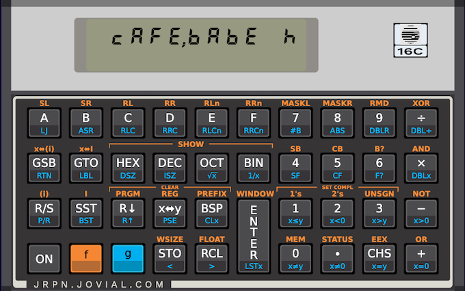

# JRPN

JRPN is a clean-room calculator simulator inspired by the HP-16C.
It uses a simulated seven-segment LCD for display, and
generally tries to remain faithful to the look-and-feel
of a real 16C.  I think of the 16C as the "vi" of calculators,
but the simulator is a bit like a modern Harley Davidson
motorcycle - I rented one once, and they engineer in a
certain amount of vibration and engine noise that are
totally unnecessary, but that make you feel like you're
"taming the iron horse."  In a similar way, this simulator
includes a slight delay and a bit of a blink on the LCD
when you do a calculator operation, and in other ways it
attempts to simulate a 1982-vintage calculator.

The calculator has some interesting features:

  * You can disable the windowing function.  If you do,
    then the digits on the LCD shrink so that they all fit.
    They get pretty small on a 64 bit binary number!  You can
    disable windowing from settings, or temporarily by pressing
    clear-prefix in integer mode.

  * You can copy the contents of the display to the clipboard.

  * From the menu, you can share the calculator state, either
    to/from the clipboard, or to an application.

  * The app can interpret a URL that contains an encoding of
    the calculator state.  This works in the web version, and
    also on the mobile versions:  Both iOS and Android apps
    register to intercept navigation to the calculator's domain.

  * If you want calculator programs to run faster, there's a setting
    for that.  But watching the 7-segment flashing "running" message
    is, to my mind, part of the fun!

  * The self-test function is implemented, and it actually does
    something!  I put some of the unit tests in the calculator --
    notably, the ones involving float and integer calculations,
    since JavaScript is a little crippled in that regard.

  * Programs and registers are stored in a common 406-nybble
    storage area, to faithfully reproduce the limitations of
    the 16C, and the behavior of registers when the word
    size is changed.  See `Memory` under `model` for some
    words about that implementation.

The design is a pretty has a pretty strict MVC separation.
Notably, the model doesn't have API dependencies on the
view or the controller.  It uses the classical MVC structure,
often imprecisely pictured like this:

There are even top-level classes called `m.Model` and `c.Controller`.
They're abstract; for the 16C the concrete subclasses are `Model16`
and `Controller16`.  The top-level widget is `Jrpn`, but the real
top-level view class is called `MainScreen`.  `c.Controller` does
*not* update the view directly.  A more precise top-level structure
in UML is as follows:

The state model of the 16C is pretty complicated -- they really
made the most out of a small package!  This complexity is managed
though extensive use of the GoF state pattern, especially in
`controller` and `controller.states`.  The controller uses the
command pattern to manage the complexity of the operations.
Check out `controller.operations` for details.

The LCD display is created using some trig.  The drawings where I
worked this out are fun -- see `Segments` under `view.lcd_display`.

As a general statement, I tried to provide good overviews, and
design documentation.  I find that this helps me to refine the
design and spot problems, but I this case I thought there might
be some value in using this project as a sort of design clinic.
It's a good size for that:  At about 10K LOC it's big enough to
have an interesting design, but not so big as to be overwhelming.
It ends up using a fair number of OO design idioms, and it's pretty
faithful to the standard GoF patterns.  

This app pushes the Dart type system a bit -- Dart's (mostly) 
sound static typing was a big help in getting the code right, 
but it did expose one place where Dart's unsound covariance 
rules hurt a bit.  See `DisplayModeSelector` under `model`
for more details on that.
